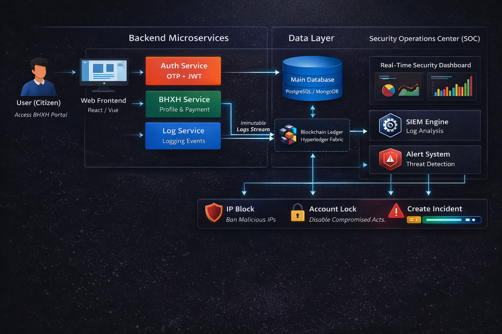

<p align="center">
  <h1 align="center">🛡️ Hệ thống Quản lý BHXH & Giám sát An ninh (SOC)</h1>
  <p align="center">
    🔐 Bảo mật cao • ⛓️ Bất biến • ⚡ Giám sát thời gian thực
  </p>

  <p align="center">
    
    
    
    
    
    
  </p>
</p>

---

## 🚀 Giới thiệu

Trong thời đại chuyển đổi số, các hệ thống quản lý dữ liệu công dân như **Bảo hiểm Xã hội (BHXH)** chứa lượng lớn thông tin nhạy cảm và trở thành mục tiêu hàng đầu của các cuộc tấn công mạng.

### ❌ Hạn chế của hệ thống truyền thống

- ❌ Dễ bị chỉnh sửa log  
- ❌ Khó truy vết sự cố  
- ❌ Thiếu giám sát thời gian thực  

---

## 💡 Giải pháp

Dự án xây dựng một nền tảng thế hệ mới, kết hợp:

- 🛡️ **SOC (Security Operations Center)**
- ⛓️ **Blockchain – Hyperledger Fabric**
- 🔐 **Mã hóa AES-256**
- ⚡ **Phát hiện & phản ứng tấn công realtime**

---

## ✨ Tính năng nổi bật

### 👨‍👩‍👧‍👦 Dành cho người dùng

- 📄 Quản lý hồ sơ BHXH  
- 💳 Thanh toán QR (VietQR)  
- 📊 Tra cứu lịch sử  
- 🔐 OTP Email (2FA)  
- 🔒 Mã hóa AES-256  

---

### 🛡️ Dành cho SOC

#### ⛓️ Blockchain Logging
- Ghi log:
  - Đăng nhập
  - Thay đổi dữ liệu
  - Lỗi hệ thống
  - Tấn công

#### 📊 Dashboard realtime
- Lưu lượng truy cập  
- Logs hệ thống  
- Cảnh báo  

#### 🤖 Phát hiện tấn công
- Brute-force  
- Unauthorized (401, 403)  
- SQL Injection  

#### ⚡ Incident Response
- 🚫 Chặn IP  
- 🔒 Khóa tài khoản  
- ⚠️ Tạo Incident  

---

## 🏗️ Kiến trúc hệ thống



---

## ⚙️ Công nghệ sử dụng

---

### 🧠 Kiến trúc tổng thể
- Microservices Architecture
- Containerization (Docker)
- Reverse Proxy (Nginx)
- Blockchain-based Logging (Hyperledger Fabric)

---

### 🌐 Ngôn ngữ lập trình

- **C#** – Backend (ASP.NET Core API)
- **JavaScript (ES6)** – Frontend & Blockchain Bridge
- **HTML5** – Cấu trúc giao diện
- **CSS3** – Thiết kế UI

---

### 🚀 Backend

- **ASP.NET Core 8** – Xây dựng RESTful API
- **Entity Framework Core** – ORM thao tác với database
- **JWT (JSON Web Token)** – Authentication & Authorization
- **Serilog** – Logging hệ thống
- **AES-256** – Mã hóa dữ liệu nhạy cảm

---

### 🎨 Frontend

- **Bootstrap 5** – UI framework
- **Vanilla JavaScript (ES6 Modules)** – Xử lý logic frontend
- **Font Awesome** – Icon UI

---

### ⛓️ Blockchain Layer

- **Hyperledger Fabric** – Blockchain permissioned
- **Node.js (Blockchain Bridge)** – Kết nối Backend ↔ Blockchain

---

### 🗄️ Database

- **Microsoft SQL Server** – Lưu trữ dữ liệu chính

---

### 🛠️ DevOps & Hạ tầng

- **Docker** – Container hóa dịch vụ
- **Docker Compose** – Quản lý multi-container
- **Nginx** – Reverse Proxy & Load Balancer
- **Git** – Version Control

---

### 📡 Tích hợp bên ngoài

- **SMTP (Email Service)** – Gửi OTP
- **VietQR API** – Thanh toán QR

---

## 🔐 Bảo mật & Kỹ thuật

### 🔑 Authentication & Authorization
- JWT Authentication
- Role-based Access Control (RBAC)

---

### 🔐 Bảo mật nâng cao

- Two-Factor Authentication (OTP Email)
- AES-256 Encryption (Data at Rest)
- HTTPS (Data in Transit)

---

### 🛡️ Giám sát & An ninh (SOC)

- Real-time Monitoring Dashboard
- SIEM-style Log Analysis
- Threat Detection:
  - Brute-force Attack
  - Unauthorized Access (401, 403)
  - SQL Injection

---

### ⛓️ Logging & Audit

- Immutable Logging (Blockchain)
- Tamper-proof system logs
- Full audit trail

---

## 🔥 Điểm mạnh

- ✅ SOC + Blockchain 
- ✅ Log không thể sửa
- ✅ Realtime detection
- ✅ Kiến trúc chuẩn doanh nghiệp

---

## ⚙️ Cài đặt

```bash
git clone https://github.com/your-repo
docker-compose up -d
